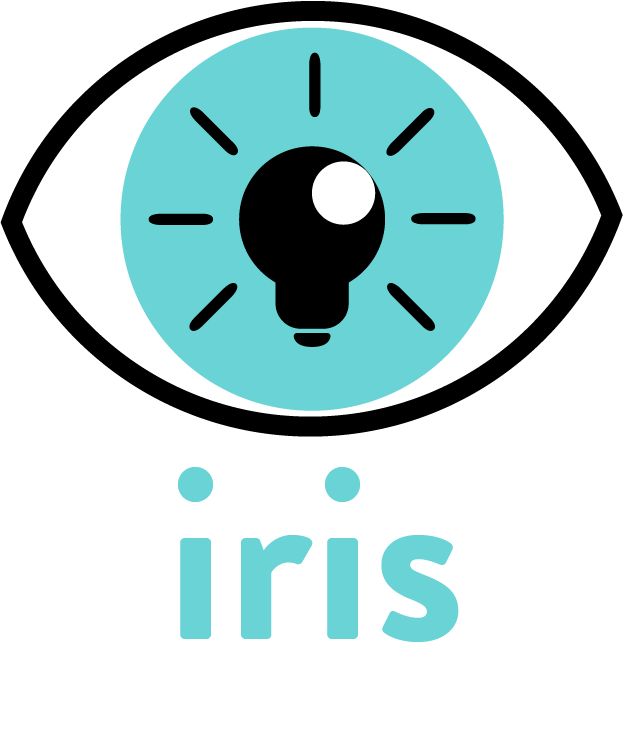

<h1 align="center"></h1>

Iris was started by a group of students at Geekwise Academy in Fresno, CA. We wanted to create something that would have a social impact in our community. We started looking at the [statistics](https://www.dosomething.org/us/facts/11-facts-about-literacy-america) on literacy levels in the United States. They are both staggering and tragic. 

Iris wants to change that.

We are an educational app aimed at improving the litteracy level of elementary aged children of all compentency levels. Iris will adapt to a childs needs to help them improve in various subjects. This is done through several components:

1 - Each child will take an evaluation test when starting a new subject. The results of that evaluation will place the student on an educational track that is best suited to their competency level. 

2 - The student will be evaluated on their progress and advanced to more difficult material as they improve. This pushes to student to continually progress at their own pace. 

3 - Questions will vary in format and allow the student to be challenged in different ways. 

4 - Parents and Teachers will be connected in communication, with a built-in chat component, to discuss the progress of the student. 

If you'd like to join us in making this happen- please read more about contributing here.
